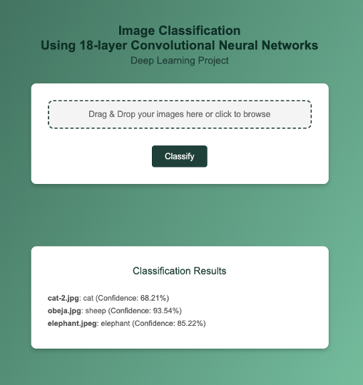

# Project | Deep Learning: Image Classification with CNN
#### Collaborators: Javier Dastas, Paola Rivera
## Description
Build a Convolutional Neural Network (CNN) model to classify images from a given dataset into predefined categories/classes.

## Dataset Chosen for the Project
Kaggle - Animals10: The second dataset contains about 28,000 medium quality animal images belonging to 10 categories: dog, cat, horse, spyder, butterfly, chicken, sheep, cow, squirrel, elephant. The link is [here](https://www.kaggle.com/datasets/alessiocorrado99/animals10/data).

## Model Deployment


## Build the Package
### To package your project, run:
```code
python setup.py sdist
```

### This will generate a .tar.gz file inside the dist/ folder. You can then install it using:
```code
pip install dist/flask_project-1.0.0.tar.gz
```

## How to generate a SECRET_KEY
### 1. Using Python:

You can generate a secure key with:
```python
import secrets

# Generate a random secret key
print(secrets.token_hex(32))
```

This command will generate a value like:

```code
6b8b4567327b23c6645cbd1b5b5651a93b775d77546a554a8ffae3a7d48e1f3c
```

### 2. Assigning it from an environment variable:

Instead of hard-coding the key into your application, it's better to load it from an environment variable:
```python
import os

app.config['SECRET_KEY'] = os.environ.get('SECRET_KEY', 'fallback-key-if-not-set')
```

***Advantage: You keep the key outside of the repository and set it in the environment where the application is deployed***